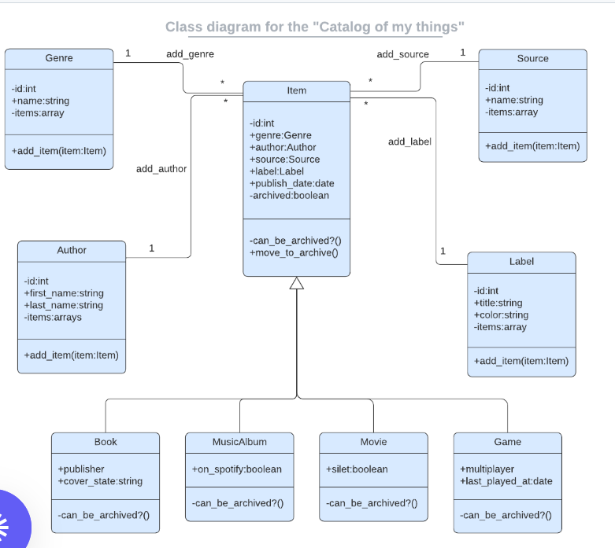

> # Catalog of my things

| Project Veiw Screenshots|
|---------------------------------------|

|
|

|

# 📗 Table of Contents

- [📖 About the Project](#about-project)
  - [🛠 Built With](#built-with)
    - [Tech Stack](#tech-stack)
    - [Key Features](#key-features)
  - [🚀 Live Demo](#live-demo)
- [💻 Getting Started](#getting-started)
  - [Setup](#setup)
  - [Prerequisites](#prerequisites)
  - [Install](#install)
  - [Usage](#usage)
  - [Run tests](#run-tests)
  - [Deployment](#triangular_flag_on_post-deployment)
- [👥 Authors](#authors)
- [🔭 Future Features](#future-features)
- [🤝 Contributing](#contributing)
- [⭐️ Show your support](#support)
- [🙏 Acknowledgements](#acknowledgements)
- [❓ FAQ (OPTIONAL)](#faq)
- [📝 License](#license)

# 📖 [Catalog of my things] 

**[Catalog of my things]** is a console app that will help you to keep a record of different types of things you own: books, music albums, movies, and games. The data will be stored in JSON files. 

## 🛠 Built With 

### Tech Stack 
- 
Client

    <ul>
      <li><a href="https://reactjs.org/">Ruby</a></li>
      <li><a href="https://reactjs.org/">PostgreSQL</a></li>
    </ul>

### Key Features 

- **[Add item]**
- **[List item]**

(<a href="#readme-top">back to top</a>)

<!-- LIVE DEMO -->

<!-- GETTING STARTED -->

## 💻 Getting Started 

To get a local copy up and running, follow these steps:

### Prerequisites

In order to run this project you need:
  - A browser of you choice.
  - A text editor of your choice.
  - An installed ruby gem on your local system

### Setup

Clone this repository to your desired folder:

- Use the following Commands:
      https://github.com/MMhaidari/ruby-capstone.git
      cd ruby-capstone    

### Usage

- ruby main.rb

### Run tests
- Run the following script and style test:

      -rspec spec ./name_of_file_spec.rb
      

(<a href="#readme-top">back to top</a>)

## 👥 Authors 
👤 **Mohammad Mohsen Haidari **

- GitHub: [Mohsen](https://github.com/MMhaidari)
- linked-in: [Mohsen](https://www.linkedin.com/in/mohammad-mohsen-haidari/)
- Twitter: [Mohsen](https://twitter.com/MMhaidari12)

👤 **Lovi Madaan**

- GitHub: [LoviMadaan](https://github.com/LoviMadaan)
- Twitter: [@lovinarang](https://twitter.com/lovinarang)
- LinkedIn: [LoviMadaan](https://www.linkedin.com/in/lovi-madaan)

 
👤 **Mudassir Nazir**
- GitHub: [@Mudassir](https://github.com/Rana-Mudassir)
- Facebook: [@Facebook](https://www.facebook.com/rana.mudasir.142)
- LinkedIn: [@LinkedIn](https://www.linkedin.com/in/mudassir-nazir/)

👤 **Frank Mugagga**

GitHub: [@githubhandle](https://www.github.com/FrankMugagga)
- Twitter: [@twitterhandle](https://www.twitter.com/@mugagga_frank)
- LinkedIn: [LinkedIn](https://www.linkedin.com/in/frank-mugagga)

(<a href="#readme-top">back to top</a>)

## 🔭 Future Features 

- [ ] **[Delete items from the catalog]**

(<a href="#readme-top">back to top</a>)

## 🤝 Contributing 

Contributions, issues, and feature requests are welcome!

Feel free to check the [issues page](https://github.com/MMhaidari/ruby-capstone/issues).

(<a href="#readme-top">back to top</a>)

## ⭐️ Show your support 

 
  If you like this project, give it a star and share it.

(<a href="#readme-top">back to top</a>)

## 🙏 Acknowledgments 

  We would like to thank Microverse and coding partners for the commitment and dedication to working and finishing the project.

(<a href="#readme-top">back to top</a>)

## ❓ FAQ (OPTIONAL) 

- **How to make it mobile friendly?**

  - Put a viewport tag in the header

- **How to design the site?**

  - Draw a mockup before start to code

(<a href="#readme-top">back to top</a>)

## 📝 License 

This project is [MIT](https://github.com/MMhaidari/ruby-capstone/blob/development/LICENSE) licensed.

(<a href="#readme-top">back to top</a>)

